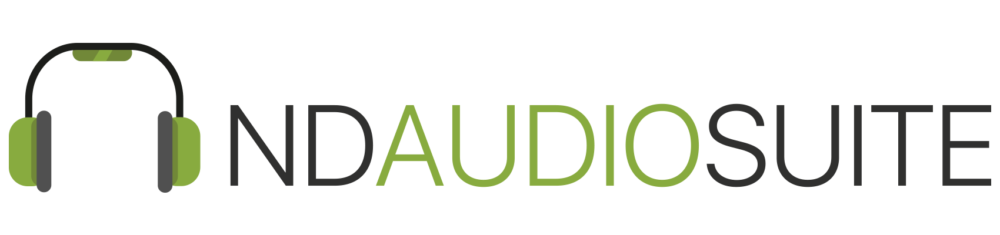

# NDAudioSuite



[](https://travis-ci.org/metova/NDAudioSuite)
[](https://img.shields.io/cocoapods/v/NDAudioSuite.svg)
[](http://cocoadocs.org/docsets/NDAudioSuite/)
[](https://coveralls.io/github/metova/NDAudioSuite?branch=master)
[](http://cocoadocs.org/docsets/NDAudioSuite)
[](http://twitter.com/metova)

NDAudioSuite is an iOS audio file streaming engine that is easy to install and use. It also includes a lightweight file downloader API that helps manage files on an iOS device.

-----

## Requirements

- iOS 8.0

-----

## Installation

NDAudioSuite is available through [CocoaPods](https://cocoapods.org/?q=NDAudioSuite). To install
it, simply add the following line to your Podfile:

```ruby
pod 'NDAudioSuite'
```

If you would like to test a beta version of NDAudioSuite, you can install the latest from develop:

```ruby
pod 'NDAudioSuite', :git => 'https://github.com/metova/NDAudioSuite.git', :branch => 'develop'
```

-----

## Usage

### NDAudioPlayer

#### Delegates
NDAudioPlayer has 4 optional delegate methods that you can use to implement audio streaming into your app. They are:

```objc
- (void) NDAudioPlayerIsReady: (NDAudioPlayer * _Nonnull)sender
```
This method tells the delegate that the internal AVPlayer is ready. Generally, you will probably not need to implement this.
There are some cases, however, where you may wish to know whether the AVPlayer is ready to start streaming your audio.

```objc
- (void) NDAudioPlayerPlaylistIsDone: (NDAudioPlayer * _Nonnull)sender
```
As the name implies, this method is called when the playlist you provide NDAudioPlayer has been played through.

```objc
- (void) NDAudioPlayerTrackIsDone: (NDAudioPlayer * _Nonnull)sender nextTrackIndex:(NSInteger)index
```
This is called when NDAudioPlayer is finished playing the current track. The nextTrackIndex parameter tells you what index of your playlist is playing next

```objc
- (void) NDAudioPlayerTimeIsUpdated: (NDAudioPlayer * _Nonnull)sender withCurrentTime:(CGFloat)currentTime
```
This method is called as often as you prefer (default is every 1 second). You can change the frequency by setting the `timeScale` property on NDAudioSuite. (where '1' = 1 second).
Most often, this can be used to update audio track progress.

#### Preparing To Play Audio
In order to play your audio, you will need to do 2 things:

First, create an instance of NDAudioSuite.

Objective-C
```objc
NDAudioSuite myPlayer = [NDAudioSuite new];
```

Swift
```swift
let myPlayer = NDAudioSuite()
```

Second, call `prepareToPlay:atIndex:atVolume`, passing in your playlist (an array of string type URLs), where in the playlist to begin playing the audio, and the volume at which you want the audio played.

```objc
[self.myPlayer prepareToPlay:self.myPlaylist atIndex:index  atVolume:volume];
```

```swift
myPlayer.prepareToPlay(myPlaylist, atIndex: index, atVolume:volume)
```

Note: The audio session type can also be configured by setting the property `audioSessionCategory` to the audio session category of your choosing. The default value is `AVAudioSessionCategoryPlayAndRecord`.

#### Audio Manipulation
As you would expect, there are 4 methods that allow you to play, pause, resume, and stop your audio

```objc
- (void)playAudio

- (void)pauseAudio

- (void)resumeAudio

- (void)stopAudio
```

There are also methods that allow you to turn on shuffling, skip ahead 1 track, and skip back 1 track

```objc
- (void) shuffleTracks:(BOOL)enable

- (NSInteger) skipTrack

- (NSInteger) previousTrack
```

If you need the current(playing) track's index, you can use:

```objc
- (NSInteger)getCurrentTrackIndex
```

It is possible to set the audio volume after initial setup by using:

```objc
- (void) setAudioVolume:(CGFloat)newVolume
```

You can get the current volume with:

```objc
- (CGFloat)getAudioVolume
```

You can also get the total duration of the current track:

```objc
- (CGFloat) getTotalDuration
```

Volume can be faded out using intervals that you set:

```objc
- (void)fadeOutWithIntervals:(CGFloat)interval
```

No audio player pod would be complete without the ability to rewind and fast forward audio. NDAudioSuite has you covered on that!

```objc
- (void)fastForwardToTime:(CGFloat)time

- (void)rewindToTime:(CGFloat) time
```

Note: Use the FF/RW methods in conjunction with `audioTimeIsUpdated:withCurrentTime:` in order to move forwards and backwards at whatever intervals you'd like.

Finally, you can always set a new playlist for your NDAudioSuite object.

```objc
- (void)setPlaylistToArray:(NSMutableArray * _Nonnull)newPlaylist
```

### NDAudioDownloadManager

#### Delegate

NDAudioDownloadManager has only 1 delegate method which notifies you when a file has been downloaded. It is called as many times as you call `downloadFileFromURL:withName:andExtension:completion`.

```objc
- (void) NDAudioDownloadManager:(NDAudioDownloadManager *_Nonnull)sender currentDownloadIsCompleteWithRemainingDownloads:(NSUInteger)count
```

#### File Manipulation

NDAudioDownloadManager has 4 methods that help you manage downloading files; the aforementioned `downloadFileFromURL:withName:andExtension:completion` along with 2 more:

```objc
- (NSURL *__nullable)getDownloadedFileFromDiskWithName:(NSString *_Nonnull)fileToBePlayed andExtension:(NSString *_Nonnull)extension

- (NSArray *__nullable)getAllDownloadedFilesFromDiskWithExtension:(NSString *_Nonnull)extension

- (void)deleteFromDiskFileWithURL:(NSURL *_Nonnull)url
```

The method names are self explanatory. For Swift, the 2 non-void methods above return an Optional.

#### File Name Helpers

NDAudioDownloadManager also has 2 method that help you with getting and removing extensions from file names

```objc
- (NSString *_Nonnull)getExtensionFromFile:(NSString *_Nonnull)fileNameWithExtension

- (NSString *_Nonnull)removeExtensionFromFile:(NSString *_Nonnull)fileName
``` 


-----

## Credits

NDAudioSuite is owned and maintained by [Metova Inc.](https://metova.com)

[Contributors](https://github.com/Metova/NDAudioSuite/graphs/contributors)

If you would like to contribute to NDAudioSuite, see our [CONTRIBUTING](CONTRIBUTING.md) guidelines.

-----

## License

NDAudioSuite is available under the MIT license. See the [LICENSE](LICENSE) file for more info.
